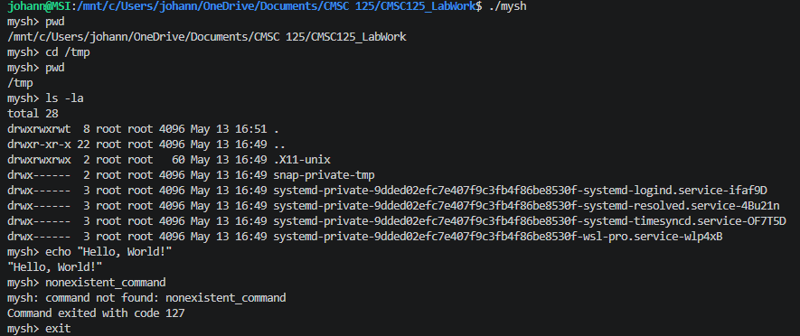
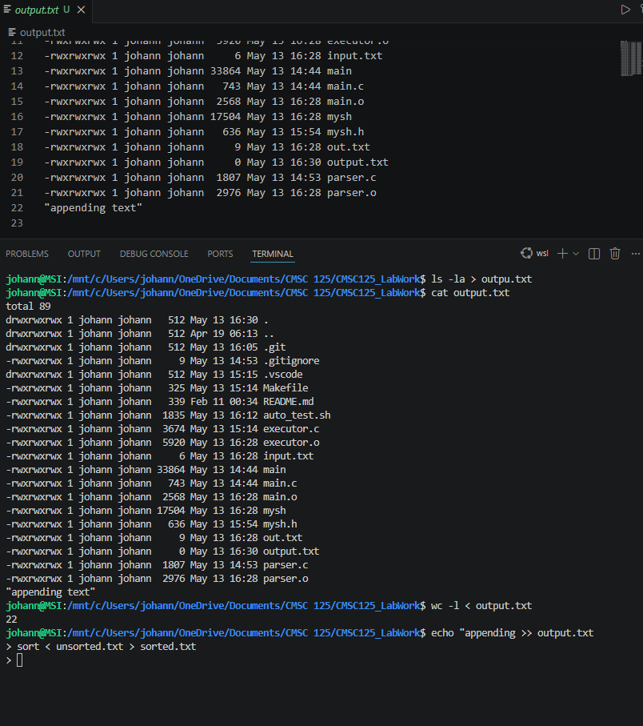
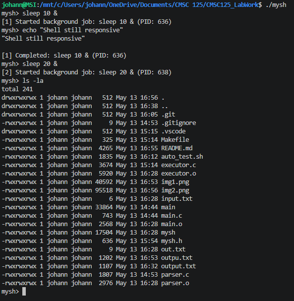

# mysh - A Simple Unix Shell

## Group Members
- **Johann Ross Yap**
- **Renz Rendel De Arroz**

## Overview
`mysh` is a custom Unix shell implemented in C that demonstrates fundamental operating system concepts such as process creation, program execution, I/O redirection, and background process management using the POSIX API. It provides a Command Line Interface (CLI) for users to interact with the system.

## Features

### 1. Command Execution
- Execution of external programs found in the system's `PATH`.
- Supports passing multiple arguments to commands.

### 2. Built-in Commands
- `cd [directory]`: Change the current working directory. Defaults to `HOME` if no directory is specified.
- `pwd`: Print the absolute path of the current working directory.
- `exit`: Gracefully exit the shell, ensuring all background jobs are accounted for.

### 3. I/O Redirection
- **Input Redirection (`<`)**: Redirect standard input from a file.
- **Output Redirection (`>`)**: Redirect standard output to a file (overwrites existing content).
- **Append Redirection (`>>`)**: Redirect standard output to a file (appends to existing content).

### 4. Background Process Management
- Appending `&` at the end of a command executes it in the background.
- The shell continues to accept new commands while background jobs run.
- Real-time notification when background jobs complete (checked before each prompt).

### 5. Robust Parsing
- Handles various whitespace characters (spaces, tabs, newlines).
- Properly separates command arguments from redirection and background symbols.

## Compilation and Usage

### Prerequisites
- A C compiler (e.g., GCC)
- `make` utility

### Compilation
To compile the project, run the following command in the project root:
```bash
make
```
This will generate the `mysh` executable.

### Running the Shell
To start `mysh`, execute:
```bash
./mysh
```

### Cleaning Up
To remove compiled object files and the executable:
```bash
make clean
```

## Architecture Overview
The project is divided into three main modules:

1. **`main.c` (REPL Loop)**:
   - Manages the Read-Eval-Print Loop.
   - Reads user input and coordinates between the parser and executor.
   - Triggers background job cleanup before each new prompt.

2. **`parser.c` (Command Parsing)**:
   - Tokenizes the input string into a structured `Command` format.
   - Identifies and extracts filenames for redirection.
   - Detects background execution requests (`&`).

3. **`executor.c` (Execution Engine)**:
   - Handles the lifecycle of processes.
   - Implements built-in commands directly.
   - Manages file descriptor manipulation for I/O redirection using `dup2` and `open`.
   - Uses `fork` and `execvp` for external command execution.
   - Maintains a simple registry of background jobs.

## Design Decisions
- **Modularity**: Separation of parsing and execution logic allows for easier testing and future extension (e.g., adding pipes).
- **Background Notification**: Chose to check for finished background jobs at the start of the REPL loop rather than using signals, ensuring terminal output remains clean and predictable.
- **POSIX Compliance**: Heavily relies on standard POSIX system calls (`fork`, `exec`, `waitpid`, `dup2`) for portability across Unix-like systems.

## Known Limitations and Bugs
- **No Piping**: Support for pipes (`|`) is currently not implemented.
- **No Wildcards**: Shell expansion for characters like `*` or `?` is not supported.
- **Single Command Line**: Only one command can be executed per line (no support for `;`, `&&`, or `||`).
- **No Job Control**: Lacks commands like `fg`, `bg`, or `jobs` to manage background processes after they start.
- **Environment Variables**: No support for setting or expanding environment variables within the shell prompt.

## Screenshots

### Basic Commands and PWD


### I/O Redirection


### Background Processes

